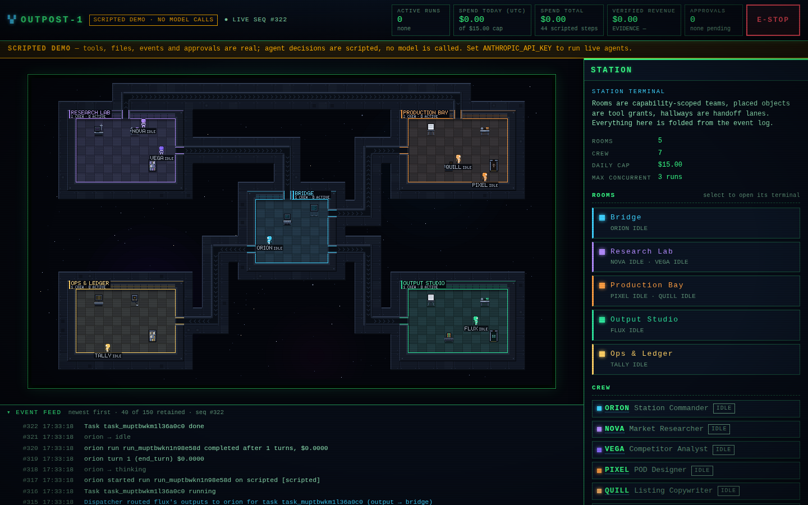

# OUTPOST

**A pixel-art control plane for a real multi-agent runtime. The station is a projection of the event log.**

Outpost runs a crew of Claude agents on your machine. Each agent sits in a room. The objects in that room decide which tools it may call, and the hallways decide whom it may hand work to. Everything the runtime does is appended to one log (`events.ndjson`): runs, tool calls, approvals, files, money. The browser folds that log through the same reducer the server uses (`shared/projector.js`) and draws the result as a space station. An agent walks to a console because an `agent.status` event says it is using the tool that console grants. A packet travels a hallway because a `handoff` event names that route. A revenue figure appears because a `ledger.entry` with `provenance: 'connector'` was fetched from Etsy's API. If the log cannot prove something, the station does not show it.

**What it is not.** It is not a money machine, and nothing here promises income. It began as an honest replica of the viral "AI agents running businesses in a space station" video, and [docs/HOW_THE_VIDEO_WORKS.md](docs/HOW_THE_VIDEO_WORKS.md) takes that video apart. The architecture is inspired by the open-source **StarNet** harness by **@androo.agi** ([github.com/androoAGI/starnet](https://github.com/androoAGI/starnet), MIT), especially its "room = capability, object = tool grant" model and its rule that the UI never simulates revenue, work or spend. Outpost is an independent implementation. It contains no StarNet code, art, sprites or branding.



*Scripted demo after a few recipes. The SCRIPTED DEMO badge and banner come from the runtime's own `meta.provider`. Spend reads $0.00 because no model was called. Verified revenue reads $0.00 because no connector entry exists, and evidence reads "—" because no revenue is counted at all (no connector or operator entry).*

---

## Contents

- [Quick start](#quick-start)
- [The product law](#the-product-law)
- [The default station](#the-default-station)
- [Recipes](#recipes)
- [What is real, and what needs a human](#what-is-real-and-what-needs-a-human)
- [Costs](#costs)
- [Architecture](#architecture)
- [Testing](#testing)
- [Security model](#security-model)
- [Limitations and roadmap](#limitations-and-roadmap)
- [License and credits](#license-and-credits)

---

## Quick start

You need Node.js 22 or newer. The only dependency is `@anthropic-ai/sdk`.

```sh
cd outpost
npm install
```

**Scripted demo (no API key, no spend).**

```sh
npm run demo          # OUTPOST_PROVIDER=scripted OUTPOST_DATA=./data-demo node sidecar/index.js
```

Open the URL the banner prints (default `http://127.0.0.1:8787/`). In this mode the agents' *decisions* are scripted templates, but everything they set in motion is real. Tool calls pass the capability check, input validation and the approval gate. Files are written and hashed, and every event is logged. Every run carries `provider: 'scripted'`, and the UI shows a persistent **SCRIPTED DEMO** banner. Every artifact a script writes says it is scripted demo content, not market research.

Try **pod_listing** from the Bridge terminal. Research, design and listing copy run in order, then ORION reviews the draft and delegates publication. The publish gate lamp turns amber and the run pauses until you grant or deny it in APPROVALS. With no Etsy connector, a granted publish is an explicit **DRY RUN**: it writes a receipt and sends nothing. The `npm run demo` script uses POSIX `VAR=value` syntax. On Windows, set the two variables in your shell first.

**Live agents (Claude).**

```sh
ANTHROPIC_API_KEY=sk-ant-... npm start
```

With `ANTHROPIC_API_KEY` or `ANTHROPIC_AUTH_TOKEN` set, the provider is `anthropic` and every agent calls the Messages API with the model in its layout entry. Every turn is priced and counted against budgets. The badge reads **ANTHROPIC API · key set, not yet verified** until an anthropic run records a `run.step`. After that it reads **LIVE · Anthropic API**. If the newest decisive run failed authentication, it reads **ANTHROPIC API · LAST CALL FAILED: AUTH**. Data goes to `outpost/data` unless `OUTPOST_DATA` says otherwise. Only one sidecar may use a data directory at a time (`outpost.lock`).

### Environment

| Variable | Default | Effect |
| --- | --- | --- |
| `ANTHROPIC_API_KEY` / `ANTHROPIC_AUTH_TOKEN` | unset | Either one selects the `anthropic` provider. The SDK reads the credential itself. |
| `OUTPOST_PROVIDER` | derived | `anthropic` or `scripted`. Overrides the choice above; any other value refuses to boot. |
| `OUTPOST_MODEL` | unset | Every agent runs on this model id instead of its layout model (anthropic only). The id must have a row in `sidecar/pricing.js`, or runs fail with `no price for model …` before the first call. |
| `OUTPOST_DATA` | `<outpost>/data` | Data directory: event log, artifacts, workspaces, memory, secrets. |
| `OUTPOST_STATION` | `<outpost>/config/station.json` | Station layout. It is validated at boot, and an invalid layout refuses to start. |
| `HOST` | `127.0.0.1` | Bind address. See [Security model](#security-model) before changing it. |
| `PORT` | `8787` | Integer `0..65535` (`0` = any free port). |
| `OUTPOST_ALLOW_HOSTS` | empty | Comma list of extra `Host` header values the DNS-rebinding guard accepts. |
| `OUTPOST_TICK_MS` | `500` | Dispatcher tick, integer `10..60000`. |
| `OUTPOST_IMAGE_PROVIDER` | unset | `openai` enables `generate_image` together with `OPENAI_API_KEY`. Any other value with a key set refuses to boot. |
| `OUTPOST_IMAGE_MODEL` | `gpt-image-2` | Image model id. |
| `OPENAI_API_KEY` | unset | Used only by the image provider. Never logged. |
| `ETSY_API_KEY` | unset | Etsy app keystring. |
| `ETSY_SHARED_SECRET` | unset | Sent as `x-api-key: <keystring>:<shared_secret>` on every Etsy request. |
| `ETSY_SHOP_ID` | unset | Your shop id. |
| `ETSY_ACCESS_TOKEN` | unset | OAuth access token. Etsy access tokens last about an hour. |
| `ETSY_REFRESH_TOKEN` | unset | Lets the connector renew the access token. The rotated pair is saved to `<data>/secrets/etsy-token.json` (mode 0600) and wins over the environment on the next boot, unless `ETSY_REFRESH_TOKEN` itself changed. |
| `ETSY_TAXONOMY_ID` | unset | Positive integer, required to create an Etsy draft listing. A malformed value refuses to boot. |
| `ETSY_SHIPPING_PROFILE_ID` | unset | Positive integer, sent with draft listings when set. A malformed value refuses to boot. |

The Etsy connector counts as configured when it has the keystring, shared secret and shop id, plus either an access token or a refresh token. Outpost has no in-app OAuth consent flow, so you obtain the tokens from your own Etsy app (see [Limitations](#limitations-and-roadmap)).

---

## The product law

These six rules are enforced in code (`CONTRACT.md` has the full contract).

1. **The interface never asserts state the runtime cannot prove.** Every number, status and animation on screen is derived from projector state, which is a pure fold of the event log. Nothing is hard-coded: no revenue, no "confidence %", no counter ticking on a timer, no fake activity. Cosmetic idle motion is allowed only while an agent is labelled IDLE. E-STOP and a dropped event stream freeze the map.
2. **Money has provenance.** Each `ledger.entry` is `connector` (fetched from a platform API, with `source.externalId`), `manual` (typed by the operator) or `agent_claim` (an agent said so). Claims are displayed, struck through and marked "CLAIM · NOT COUNTED". They are never summed. Counted totals are USD only. Entries in another currency are tallied apart and never shown as dollars.
3. **Capability law.** Room = capability-scoped team, object = tool grant, hallway = handoff lane. The tool list offered to the model is computed from the layout, and every call is re-checked before it runs.
4. **Consent.** Tools with `sensitivity: 'approval'` (`publish_listing`, `deliver_order`) pause the run and emit `approval.requested`. Nothing leaves the machine until the operator grants it. With no connector, "publish" is an explicit dry run that writes a file and says so.
5. **Cost is real.** Every provider step emits `run.step` with `usage` and `costUsd` from `sidecar/pricing.js`. Image generation emits `spend.recorded`. Per-run and station-daily budgets stop runs with `budget_exceeded`.
6. **Scripted mode is labelled.** Without Claude credentials the runtime uses the scripted provider. Every `run.started` says `provider: 'scripted'`, and the UI shows a persistent SCRIPTED DEMO banner. When a live station's log also holds scripted runs, the banner says so, and those records carry a SCRIPTED mark.

---

## The default station

`config/station.json` defines **OUTPOST-1**: a 56×33 grid of 16 px tiles, five rooms, five hallways and seven agents. The runtime computes permissions from it, and the room terminals display them, both from the same `shared/grants.js`.

### Rooms

| Room | Purpose (from the layout) | Objects |
| --- | --- | --- |
| **Bridge** (`bridge`) | Command authority: decomposes goals, delegates, reviews results, arbitrates priorities. | `bridge-console` command_console, `bridge-board` status_board |
| **Research Lab** (`research`) | Market and competitor research. Produces briefs, never products. Cannot publish or touch money. | `research-terminal` research_terminal, `research-bench` workbench, `research-archive` archive |
| **Production Bay** (`production`) | Print-on-demand factory: original designs, listing copy, listing drafts. Publishing is gated by the operator. | `prod-design` design_station, `prod-bench` workbench, `prod-composer` listing_composer, `prod-gate` publish_gate |
| **Output Studio** (`output`) | Service and digital-goods work: thumbnails to a client brief, asset packs. Delivery is gated by the operator. | `out-design` design_station, `out-bench` workbench, `out-packager` packager, `out-gate` delivery_gate |
| **Ops & Ledger** (`ops`) | Books and telemetry: syncs connectors, reconciles revenue with provenance, reports. Cannot create products. | `ops-ledger` ledger_terminal, `ops-dock` connector_dock, `ops-archive` archive |

### Objects → tool grants

Generated from `OBJECT_GRANTS` in `shared/grants.js` and the placements in `config/station.json`. **(approval)** marks a tool that pauses for the operator. `handoff` is intrinsic: every agent gets it (with no object behind it) when its room has a hallway or a teammate.

| Object type | Grants | Placed as |
| --- | --- | --- |
| `command_console` | `delegate_task`, `list_tasks`, `read_artifact` | `bridge-console` |
| `status_board` | `read_ledger`, `list_artifacts` | `bridge-board` |
| `research_terminal` | `web_search`, `web_fetch` (Anthropic server tools) | `research-terminal` |
| `workbench` | `write_file`, `read_file`, `list_files`, `read_artifact` | `research-bench`, `prod-bench`, `out-bench` |
| `archive` | `memory_read`, `memory_write`, `list_artifacts` | `research-archive`, `ops-archive` |
| `design_station` | `render_svg_design`, `generate_image`, `read_artifact` | `prod-design`, `out-design` |
| `listing_composer` | `create_listing_draft` | `prod-composer` |
| `publish_gate` | `publish_listing` **(approval)** | `prod-gate` |
| `packager` | `package_deliverable`, `list_artifacts` | `out-packager` |
| `delivery_gate` | `deliver_order` **(approval)** | `out-gate` |
| `ledger_terminal` | `read_ledger`, `record_ledger_claim` | `ops-ledger` |
| `connector_dock` | `sync_connector` | `ops-dock` |

The layout's consequences, as `toolsForAgent` computes them:

- The **Research Lab** can search the web but cannot publish, deliver or touch the ledger.
- The **Production Bay** holds the publish gate and has no web tools.
- Only the **Bridge** can delegate. It has no workbench, so ORION writes no files.
- **Ops** has no workbench and no `read_artifact`. TALLY files its report in room memory.

### Hallways (handoff lanes)

| Hallway | Connects |
| --- | --- |
| `h-research-bridge` | Research Lab ↔ Bridge |
| `h-bridge-production` | Bridge ↔ Production Bay |
| `h-bridge-output` | Bridge ↔ Output Studio |
| `h-bridge-ops` | Bridge ↔ Ops & Ledger |
| `h-research-production` | Research Lab ↔ Production Bay |

A peer `handoff` reaches teammates in the same room or across exactly one hallway. Anything farther must go through the commander. `delegate_task` (Bridge only) reaches any room the hallways connect.

### Crew

| Agent | Title | Room | Model | Effort | Max turns | Run budget |
| --- | --- | --- | --- | --- | ---: | ---: |
| ORION (`orion`) | Station Commander | Bridge | `claude-opus-5-5` | high | 14 | $1.50 |
| NOVA (`nova`) | Market Researcher | Research Lab | `claude-opus-5-5` | medium | 12 | $1.00 |
| VEGA (`vega`) | Competitor Analyst | Research Lab | `claude-opus-5-5` | medium | 12 | $1.00 |
| PIXEL (`pixel`) | POD Designer | Production Bay | `claude-opus-5-5` | medium | 12 | $1.00 |
| QUILL (`quill`) | Listing Copywriter | Production Bay | `claude-opus-5-5` | medium | 10 | $0.75 |
| FLUX (`flux`) | Thumbnail & Asset Artist | Output Studio | `claude-opus-5-5` | medium | 12 | $1.00 |
| TALLY (`tally`) | Ops & Ledger Officer | Ops & Ledger | `claude-opus-5-5` | low | 8 | $0.50 |

Station budgets: **$15 per UTC day** (`budgets.stationDailyUsd`) and **at most 3 concurrent runs** (`budgets.maxConcurrentRuns`). Each agent runs at most one run at a time.

---

## Recipes

Recipes are multi-stage workflows (`sidecar/recipes.js`). Launch one from the Bridge terminal, with `POST /api/recipes/:name`, or on a schedule (`POST /api/schedules`). A stage starts when the stages it depends on are `done`, and it receives their outputs as inputs. Every brief carries the originality rule and names the artifact the stage must produce.

| Recipe | Default params | Stages |
| --- | --- | --- |
| `pod_listing` | `niche: "botanical typography sweatshirts"`, `audience: "women 25-40 who garden"` | NOVA researches the niche (markdown brief) → PIXEL designs an original SVG → QUILL writes the listing draft (after both) → ORION reviews and **delegates publication** to QUILL, which pauses for approval. When the publish task finishes, ORION gets a review task. |
| `thumbnail_order` | `video_title: "I Survived 7 Days in a Cabin During a Blizzard"`, `order_ref: "DEMO-ORDER-1"`, `style: "dramatic, high contrast"` | VEGA writes the intake spec → FLUX drafts three 1280×720 variants, scores them and packages the winner → ORION reviews and **delegates delivery** to FLUX, which pauses for approval and writes a manual hand-off sheet → ORION reviews. |
| `competitor_scan` | `market: "YouTube thumbnail design gigs"` | NOVA (demand) and VEGA (competitors) in parallel → ORION writes the synthesis as its final reply. |
| `ledger_report` | none | TALLY syncs connectors (it says so when none is configured), reads the ledger by provenance and files the report in Ops memory (`ledger-report`). |

Params must be single-line strings of 1–200 characters, and only the recipe's own keys are accepted. An operator **goal** (`POST /api/goals`) becomes a task for the agent holding the command console, which can then delegate.

---

## What is real, and what needs a human

| Real, proven by the runtime | Needs a human |
| --- | --- |
| Model calls, their token usage and their cost (`run.step`); image spend (`spend.recorded`) | Granting or denying every publish and delivery (the approval gate) |
| Tool execution under the capability law, and every denial with its reason | Obtaining Etsy OAuth tokens (no in-app consent flow yet) |
| Artifacts on disk with sha256, re-verified before serving, packaging or delivery | **Activating** any Etsy listing in Shop Manager. Outpost never activates one. |
| **Publishing = an Etsy DRAFT listing** (connector configured) or an explicit **DRY RUN** receipt (no connector). PNG/JPEG designs are uploaded to the draft; SVG designs are skipped and the receipt says why. | **AI disclosure**: Etsy's "How it's made" / AI-generator field is not in the API. Set it in Shop Manager before activating. Outpost appends the draft's `ai_disclosure` text to the description. |
| Etsy revenue, refunds and selling fees from `getShopReceipts` and the payment-account ledger, deduplicated by external id | Rasterizing SVG designs to PNG/JPEG, plus shipping profile, returns and production-partner setup in Shop Manager |
| Budgets, E-STOP, crash recovery, and approvals expiring when the sidecar restarts | **Fiverr delivery = manual hand-off.** Fiverr has no seller API. `deliver_order` writes a sheet listing the verified files and the message to paste, and you deliver it. |
| | Fiverr and other off-API income, entered as `manual` ledger entries (USD only) |
| | IP judgement: no trademark search or similarity gate exists. The originality rules in prompts are advisory. |

---

## Costs

**Pricing source.** `sidecar/pricing.js` holds Anthropic's published per-million-token prices. Nothing else in the runtime hard-codes a model rate; the per-image estimates below live in `sidecar/images.js`.

| Model | Input | Output | Cache write 5m | Cache write 1h | Cache read |
| --- | ---: | ---: | ---: | ---: | ---: |
| `claude-opus-5-5` | $4 | $20 | $5 | $8 | $0.20 |
| `claude-sonnet-5-5` | $2 | $10 | $2.50 | $4 | $0.20 |
| `claude-haiku-4-5` | $1 | $5 | $1.25 | $2 | $0.10 |
| `claude-opus-5`, `claude-opus-4-8` (fallback targets) | $5 | $25 | $6.25 | $10 | $0.50 |
| `claude-sonnet-5` (fallback target) | $2 | $10 | $2.50 | $4 | $0.20 |

- **Web search** is billed at $10 per 1,000 requests.
- **Scripted runs** cost $0.
- **Unknown models.** A requested model without a price never runs.
- **Fallbacks.** When a server-side fallback served part of a turn, each part is priced at the model that ran it. A fallback model missing from the table is billed at the highest known rate, never $0.
- **Image generation** (`gpt-image-2` at medium quality) is recorded at a per-image estimate: $0.053 for 1024×1024 and $0.041 for 1536×1024 or 1024×1536. These come from secondary sources and are flagged unverified in the economics doc.

**Budgets.**

- Each agent has a run budget, and the station has a $15 daily budget (UTC day).
- Before every provider call and every tool call, the loop stops a run when station spend today is at or above the daily cap, or when the run's cost is above its budget.
- A run can therefore exceed its budget by at most the cost of its last turn.
- A spent daily budget holds queued work until the next UTC day; it does not fail it.
- `generate_image` refuses up front when its estimate exceeds what is left.

**What a pipeline run costs.** No measured live figure is published here. Measure your own with the SPEND chips, which sum `run.step` and `spend.recorded` events.

- **Modelled costs** come from [docs/ECONOMICS_AND_POLICY.md](docs/ECONOMICS_AND_POLICY.md) §3, at Opus 5.5 prices:
  - **LLM work per listing:** $0.21 for a lean profile, $1.63 for a heavy one.
  - **All-in per listing** (adding 2–6 images and the $0.20 Etsy listing fee): **$0.49 to $3.09**.
  - These are modelled token profiles, not measurements.
- **Budget ceilings** follow from the code. Each figure is the sum of the run budgets a recipe creates, plus at most one turn of overshoot per run:

| Recipe | Runs per pass | Ceiling |
| --- | --- | ---: |
| `pod_listing` | NOVA, PIXEL, QUILL, ORION, QUILL (publish), ORION (final review) | $6.50 |
| `thumbnail_order` | VEGA, FLUX, ORION, FLUX (delivery), ORION (final review) | $6.00 |
| `competitor_scan` | NOVA, VEGA, ORION | $3.50 |
| `ledger_report` | TALLY | $0.50 |

A revision that ORION delegates adds more runs. Delegation chains are capped at 8 deep, and the daily cap bounds everything.

For the business side, see the economics doc. It covers what the video's Etsy store plausibly nets after fees and cost of goods, the break-even sell-through, and the platform policies.

---

## Architecture

```
                         Browser (vanilla ES modules, no build step)
 ┌──────────────────────────────────────────────────────────────────────────────┐
 │ main.js → app.js createClient()                                              │
 │   1. GET /api/snapshot            → { seq, state, meta }                     │
 │   2. EventSource /api/events?since=<seq>   (replay, then live)               │
 │   3. apply(state, event) from /shared/projector.js  (same reducer as server) │
 │ world.js  canvas station  ◄── client.state ──►  ui.js  terminals/approvals   │
 └───────────────▲───────────────────────────────────────────┬──────────────────┘
                 │ SSE  id:<seq> event:outpost data:<json>    │ POST + x-outpost-client: 1
 ┌───────────────┴───────────────────────────────────────────▼──────────────────┐
 │ Sidecar: node sidecar/index.js   (127.0.0.1:8787, one per data dir)          │
 │                                                                              │
 │  server.js ──► dispatcher.js ──► loop.js ──► providers/anthropic.js          │
 │      │             │   ▲            │        providers/scripted.js+scripts.js │
 │      │             │   │            ├──► capability.js (checkCall per call)  │
 │      │        scheduler.js          └──► tools/*.js ──► connectors/etsy.js    │
 │      │             │                          │          images.js (OpenAI)  │
 │      ▼             ▼                          ▼                              │
 │  store.js  append: validate (shared/events.js) → persist → apply → notify    │
 │      │                                                                       │
 └──────┼───────────────────────────────────────────────────────────────────────┘
        ▼
   <data>/events.ndjson   artifacts/<id>/   workspaces/<agent>/   memory/<room>/
   secrets/etsy-token.json   outpost.lock
```

### File map

| Path | Role |
| --- | --- |
| `shared/events.js` | Event catalog (the contract), `validatePayload`, `preview` |
| `shared/projector.js` | Pure reducer `apply` / `project` / `initialState`, feed text, evidence coverage, `anthropicStatus` |
| `shared/grants.js` | `OBJECT_GRANTS`, `INTRINSIC_TOOLS`, used by both the runtime and the UI |
| `config/station.json` | Default layout: rooms, objects, hallways, agents, budgets |
| `sidecar/index.js` | Boot: data-dir lock, layout validation, recovery, banner |
| `sidecar/config.js` | `loadConfig(env)` |
| `sidecar/store.js` | Append-only NDJSON log, replay, fail-stop on write errors |
| `sidecar/capability.js` | `toolsForAgent`, `checkCall`, `route`, `canHandoff`, `canDelegate`, `validateStation` |
| `sidecar/loop.js` | `runAgentLoop`: one run of one agent on one task |
| `sidecar/dispatcher.js` | Task lifecycle, scheduling, delegation and reviews, approvals, E-STOP, recovery |
| `sidecar/scheduler.js` | `every <n>m\|h` and 5-field UTC cron schedules |
| `sidecar/recipes.js` | `RECIPES`, `planRecipe` |
| `sidecar/prompts.js` | `systemPrompt` (byte-stable, cached), `taskMessage` |
| `sidecar/pricing.js` | `PRICES`, `costOf`, `costByModel` |
| `sidecar/providers/` | `anthropic.js` (Messages API via the SDK), `scripted.js` + `scripts.js` (offline demo) |
| `sidecar/tools/` | Tool registry (`index.js`) and implementations: files, memory, design, commerce, ledger, coordination |
| `sidecar/connectors/etsy.js` | Etsy Open API v3: receipts, refunds, fees, draft listings, image upload, OAuth refresh |
| `sidecar/images.js` | OpenAI image provider (optional) |
| `sidecar/svg.js` | SVG sanitizer (allow-list) |
| `sidecar/artifacts.js` | Artifact files (atomic writes, sha256 recorded and re-verified on read), web-taint record |
| `sidecar/server.js` | HTTP API, SSE, static files, security guards |
| `frontend/` | `index.html`, `main.js`, `app.js` (sync), `world.js` (canvas), `sprites.js` / `pixelfont.js` (procedural art), `ui.js` (terminals), `style.css` |
| `scripts/ui-smoke.mjs` | Playwright smoke test |
| `scripts/fixture-server.mjs` | Dev-only synthetic event server (never product state) |
| `test/` | `node:test` suites |
| `docs/` | [BUILD_SPEC.md](docs/BUILD_SPEC.md), [HOW_THE_VIDEO_WORKS.md](docs/HOW_THE_VIDEO_WORKS.md), [ECONOMICS_AND_POLICY.md](docs/ECONOMICS_AND_POLICY.md), screenshots |

[docs/BUILD_SPEC.md](docs/BUILD_SPEC.md) is the engineering spec. It has enough detail to rebuild Outpost.

---

## Testing

```sh
npm test                                   # node --test test/*.test.js
```

- **Offline.** The suite runs offline in a few seconds: 310 tests across 19 files at the time of writing.
  - Etsy, OpenAI and Anthropic are never called. Each has an injected `fetchImpl` or client.
  - The end-to-end tests boot the real sidecar on port 0 with the scripted provider. They drive whole recipes through the HTTP API and the SSE stream: approvals granted and denied, a restart mid-approval, and a second sidecar refused on the same data dir.
- **UI smoke** (Playwright, desktop 1440×900 and phone 390×844). It fails on any console error, page error or horizontal page scroll, then prints `PASS` or `FAIL`:

  ```sh
  OUTPOST_PROVIDER=scripted OUTPOST_DATA=$(mktemp -d) PORT=8799 node sidecar/index.js &
  SIDECAR=$!
  node scripts/ui-smoke.mjs http://127.0.0.1:8799 /tmp/outpost-shots
  kill $SIDECAR
  ```

- **Fixture server.** `node scripts/fixture-server.mjs [port]` (default 8790) serves the frontend against a fabricated event sequence, so the UI can be developed without the runtime. It is **dev-only**. Its events are test data and must never be presented as product state.

---

## Security model

- **Network.**
  - The server binds to loopback by default.
  - Requests whose `Host` is not `localhost`, `127.0.0.1` or `[::1]` (or listed in `OUTPOST_ALLOW_HOSTS`) get 421. This is the DNS-rebinding guard, and the whole header must parse.
  - Every POST needs `x-outpost-client: 1`. This forces a CORS preflight, which the server never approves (`OPTIONS` gets 405 with no CORS headers). A present `Origin` must match the `Host`.
  - `GET /api/*` refuses cross-site requests.
  - JSON bodies are capped at 1 MB.
  - There is **no authentication**: anyone who can reach the port controls the station. Keep it on loopback.
- **Browser.**
  - The app is served with a strict CSP.
  - Artifacts are served only after their sha256 matches the log, with `default-src 'none'; style-src 'unsafe-inline'; img-src data:; sandbox` and `nosniff`.
  - The UI shows artifacts through `` or as escaped text, and never puts model or artifact content into `innerHTML`.
- **Secrets.**
  - Keys stay in the sidecar's config. They never appear in events, snapshots or HTTP responses.
  - Etsy and OpenAI errors are redacted, including rotated tokens.
  - The Etsy token file is 0600 inside a 0700 `secrets/` directory.
- **Capabilities.**
  - The tool list is computed from the layout, and every call is re-checked.
  - Agent file access is jailed to the agent's workspace. Absolute paths, `..`, NUL bytes and symlink escapes are refused.
  - SVGs pass an allow-list sanitizer: no script, no foreign elements, no external references, no CSS escapes.
  - Room memory keys match `[a-z0-9-]{1,48}`.
- **Consent and halts.**
  - Publish and deliver wait for the operator.
  - E-STOP aborts every run at once, even one that is waiting on a tool. Tools pass the abort signal to their outbound requests.
  - A run halted after a granted external action is never retried automatically.
- **Prompt injection.**
  - Web content is **marked, not quarantined**. A run that used `web_search` or `web_fetch`, read a web-tainted artifact, memory note or task, or was handed one is web-tainted for the rest of its life.
  - Everything such a run writes, and every approval it requests, carries `taint: 'web'` with its sources, and the UI flags it.
  - Tainted inputs reach the model inside `<untrusted_artifact>` blocks.
  - Taint does not revoke tools. The approval gate is the backstop.
- **Integrity.**
  - One sidecar per data dir, enforced by `outpost.lock`.
  - A failed log write turns the store read-only (POSTs answer 503) instead of letting state run ahead of the disk.

---

## Limitations and roadmap

These are honest gaps, not a sales list.

- **No computer use or browser automation.** Agents act only through the tools above. Nothing drives Etsy, Fiverr or any other website.
- **No Printify (or other print-on-demand) connector yet.** Cost of goods is not fetched. Enter it as a `manual` cost.
- **No rasterizer.** Designs are SVG unless an image provider is configured. Etsy does not accept SVG listing images, so drafts made from SVG designs reach Etsy without images.
- **No in-app Etsy OAuth (PKCE) flow.** You supply the tokens. With a refresh token, renewal is automatic.
- **Fee coverage.** Etsy fees come only from payment-account ledger types on a conservative allow-list. Each sync reports the types it skipped, and the list must be re-verified against a real shop's ledger. Shop visits and conversion are not available from Etsy's API, so Outpost never shows them.
- **USD only for counted money.** Nothing converts currencies, and manual entries must be USD.
- **Single user, localhost.** There are no accounts and no authentication.
- **Scripted demo decisions are templates.** They react to real tool results, but they are not research, not judgement and not a model. Every scripted artifact says so.
- **Prompt-injection defence is labelling plus human approval.** There is no quarantined reader and no automatic tool revocation.
- **No IP gate.** There is no trademark search or similarity check. Originality is a prompt rule plus your review.
- **Operator surfaces.** Schedules and direct operator tasks are API-only (`POST /api/schedules`, `POST /api/tasks`). Schedules cannot be disabled once created, and cron schedules do not catch up after downtime.

Roadmap candidates, roughly in order: SVG→PNG rasterization, a Printify connector for cost of goods, an Etsy OAuth consent flow, a quarantined schema-only reader for web research, an IP/similarity gate, and schedule management in the UI.

---

## License and credits

- Outpost's code is MIT-licensed, as declared in `package.json`.
- Architecture inspired by **StarNet** by **@androo.agi** ([github.com/androoAGI/starnet](https://github.com/androoAGI/starnet), MIT). No StarNet code, brand, art or sprites are used: Outpost's pixel art and font are drawn procedurally in `frontend/sprites.js` and `frontend/pixelfont.js`.
- Etsy, Fiverr, Printify, OpenAI and Anthropic are trademarks of their owners. Outpost is not endorsed or certified by any of them.
